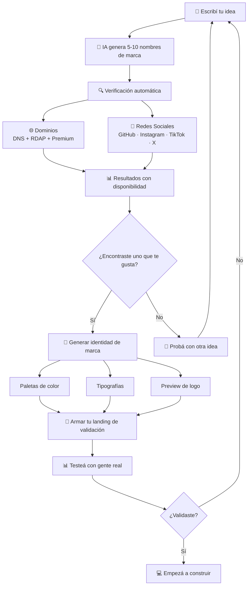

## Me pasaba todo el tiempo: me entusiasmaba con una idea, programaba durante semanas, y cuando quería lanzarla… el nombre ya estaba tomado o el producto no se vendia

Conocés esa sensación. Te levantás un domingo a las 7 de la mañana con una idea que te parece brillante. La misma mañana ya tenés el repo inicializado, el primer commit, y la estructura del proyecto lista. Durante las semanas siguientes, invertís decenas (o cientos) de horas construyendo algo que te apasiona.

Y entonces llega el momento de lanzar.

Buscás el dominio `.com`. Tomado. El `.io` también. El usuario de Instagram no existe… pero alguien lo reservó hace tres años y nunca lo usó. En GitHub ya hay un proyecto con ese nombre que tiene más estrellas que lo que vos jamás vas a lograr.

**Todo ese trabajo, todo ese tiempo, y ni siquiera podés llamar a tu producto como querías.**

Si sos fundador primerizo o indie dev, probablemente te identificaste con esa historia. No es casualidad: es un patrón que se repite constantemente en la comunidad. Y tiene una causa de fondo: **validamos después de construir**, cuando debería ser exactamente al revés.

## El problema no es tu código. Es el orden en que hacés las cosas

La mayoría de los fundadores técnicos —yo incluido— cometemos el mismo error una y otra vez. Pensamos que validar una idea significa escribir código, hacer un MVP, y ver si la gente lo usa. Pero hay un paso anterior que casi siempre saltamos: **validar la identidad del producto antes de que exista.**

Y no, no hablo de hacer un estudio de mercado de 50 páginas. Hablo de algo mucho más simple y más importante de lo que parece.

Pensá en esto: el nombre de tu producto es lo primero que va a ver la gente. Es lo que va a aparecer en la barra del navegador, en los resultados de Google, en las tarjetas de presentación, en las conversaciones con potenciales inversores. Si tu nombre no está disponible donde necesitás que esté, no importa qué tan bueno sea tu producto: **vas a empezar con desventaja.**

Pero no es solo el nombre. Es el dominio. Es el handle de Instagram. Es el usuario de TikTok. Es la coherencia de tu marca desde el día cero. Cada uno de esos elementos es una pequeña puerta que, si está cerrada, te obliga a usar alternativas que nunca quisiste.

> [!WARNING]
> El 73% de los dominios .com de una sola palabra ya están registrados. Y la mayoría de los nombres de marca "bonitos" de dos palabras también. Cuanto más esperés, menos opciones vas a tener.

Acá entra la pregunta clave: **¿por qué no validamos todo esto antes de empezar a programar?**

La respuesta suele ser una combinación de tres cosas: entusiasmo (queremos codear YA), falta de herramientas (el proceso actual es tedioso), y una falsa sensación de que "el nombre se define después". Pero la realidad es que el nombre es parte del producto. Y definirlo tarde es como elegir el color de tu auto después de haberlo pintado.

## Qué es FounderCheck y por qué lo estoy construyendo

**FounderCheck** es una plataforma que está diseñada para resolver exactamente este problema. La idea es simple: ingresés una idea en lenguaje natural (como "quiero una app para reservar canchas de paddle") y en minutos recibís nombres de marca creativos, con la disponibilidad verificada de dominios y redes sociales para cada uno.

Y no solo eso: también te va a generar una identidad visual básica —paletas de color, tipografías, un preview de logo— para que puedas armar una landing de validación y salir a testear tu idea con gente real **antes de escribir una sola línea de código.**

Lo estoy construyendo porque es la herramienta que yo necesito. Como developer, tengo varios proyectos que me gustaría hacer. Y siempre hago lo mismo: me pongo a programar, le dedico semanas, y cuando quiero lanzar… me doy cuenta de que no tengo nombre, no tengo dominio, no tengo marca, y encima necesito empezar todo de cero con la identidad del producto.

FounderCheck es mi intento de cambiar ese approach. De ahora en más, quiero **primero validar, después construir.**

## Los cinco beneficios que van a cambiar tu flujo como fundador

### 1. Nombres de marca con IA, en tu idioma

Escribí tu idea como se te ocurra. No hace falta que sea sofisticada, ni que use palabras clave específicas. La inteligencia artificial detrás de FounderCheck está diseñada para interpretar tu idea y generar entre 5 y 10 nombres de marca con estilo propio —brandable, descriptivo, híbrido, creativo— y una justificación para cada uno.

> [!TIP]
> Si tu idea es "una plataforma para conectar mascotas con paseadores", no necesitás pensar en nombres. Escribí exactamente eso. La IA se encarga del resto.

Además, el sistema detecta automáticamente el idioma en el que escribiste y responde en ese mismo idioma. Pensá tu idea en español, recibí nombres y explicaciones en español. Simple.

### 2. Verificación triple de dominios (no te mienten)

Acá viene algo que parece menor pero es gigante. La mayoría de las herramientas de búsqueda de dominios te dicen "disponible" o "no disponible", y listo. Pero la realidad es más compleja que eso.

FounderCheck usa un sistema de triple verificación:

1. **DNS** — Consulta los servidores DNS para ver si el dominio realmente existe.
2. **RDAP** — Verifica en los registros públicos si alguien lo registró.
3. **Detección de premium** — Si el dominio existe, hace una petición HTTP para detectar si es una página de parking o estacionamiento (esos dominios que parecen disponibles pero en realidad están a la venta por miles de dólares).

Esto significa que no solo sabés si un dominio está libre. También sabés si está tomado pero "parece libre", lo que te ahorra una frustración enorme.

### 3. Verificación cruzada de redes sociales

Tu marca necesita ser coherente en todas partes. No sirve de nada que `tuproyecto.com` esté disponible si `@tuproyecto` en Instagram lo tiene alguien que nunca lo usa.

FounderCheck verifica la disponibilidad de username en **GitHub, Instagram, TikTok y X** al mismo tiempo. Cada resultado tiene un badge con el estado que, al hacer clic, te lleva directamente a la plataforma para que verifiques vos mismo.

### 4. Identidad de marca instantánea

Esta es una de las features que más me entusiasma. Una vez que encontrás un nombre que te gusta, FounderCheck va a poder generar una identidad visual completa:

- **Paletas de color** (3-5 opciones con colores primarios, secundarios, acentos, fondos y texto)
- **Tipografías recomendadas** con justificación de por qué funcionan para tu marca
- **Preview de logo** que te muestra cómo se ve tu nombre con la tipografía y el color principal

No reemplaza a un diseñador, obviamente. Pero te da algo que puedas usar **hoy mismo** para armar una landing page de validación y salir a testear tu idea.

### 5. Todo en un solo lugar

Y este es quizás el diferencial más importante. Hoy, para hacer lo que FounderCheck va a hacer en minutos, necesitás:

- Ir a Namecheap o GoDaddy para buscar dominios
- Ir a Namechk para verificar handles
- Ir a Namelix para generar nombres con IA
- Ir a Coolors para generar paletas
- Ir a Google Fonts para buscar tipografías
- Y después intentar que todo tenga sentido junto

Con FounderCheck, todo ese flujo está diseñado para pasar en una sola pantalla, de forma fluida y coherente.

## Cómo funciona (para que no tengas que adivinar)

El flujo de uso está pensado para ser lo más simple posible. Así es como se ve:

El paso más importante no es técnico, es mental. Se trata de cambiar el orden: en vez de *construir → lanzar → descubrir que el nombre está tomado*, el flujo es *idear → validar identidad → testear → recién ahí construir*.

## Tres escenarios donde FounderCheck está diseñado para brillar

### Escenario 1: El indie dev con demasiadas ideas

Tenés un documento de notas lleno de ideas de proyectos. Algunas son apps, otras son SaaS, otras son herramientas open source. El problema no es que te falten ideas —es que nunca sabés por cuál empezar.

Con FounderCheck, podés tomar cada idea, tipearla, y en minutos tener una lista de nombres posibles con su disponibilidad. Si un nombre está disponible en todas partes, es una señal positiva. Si todo está tomado, quizás esa industria está saturada y conviene explorar otra idea.

> [!NOTE]
> La disponibilidad de nombres no es una métrica perfecta de validez de mercado, pero sí es un indicador temprano. Si el nombre de tu idea en su forma más simple ya está tomado en todas partes, es probable que ya existan muchos jugadores en ese espacio.

### Escenario 2: El fundador primerizo que va a lanzar por primera vez

Es tu primera startup. No tenés experiencia registrando dominios, no sabés qué TLDs usar (.com, .io, .dev, .co), y no tenés idea de cómo elegir un nombre que suene profesional.

FounderCheck te guía por todo ese proceso. Ingresás tu idea, la IA te sugiere nombres con diferentes estilos, y cada nombre viene con la disponibilidad verificada. No necesitás saber nada sobre DNS, RDAP, o marketing de marcas. Todo está diseñado para que el resultado sea claro y accionable.

### Escenario 3: Quien necesita una landing ANTES de programar

Este es mi caso personal. Quiero validar si mi idea tiene tracción real antes de invertir semanas de desarrollo. Para eso, necesito una landing page que explique qué es el producto, capture emails de interesados, y me dé una señal de que vale la pena seguir.

Pero para tener una landing, necesito un nombre. Y para tener un nombre, necesito verificar que esté disponible. Y para que la landing se vea profesional, necesito identidad visual.

FounderCheck está diseñado para darte todo eso en minutos. Así podés armar tu landing con herramientas como Carrd o Astro, salir a testear, y **recién ahí decidir si vale la pena programar.**

## Qué hace diferente a FounderCheck (porque sí, hay otras herramientas)

No voy a hacerme el que reinventó la rueda. Existen herramientas para buscar dominios (Lean Domain Search), para generar nombres con IA (Namelix), para verificar handles (Namechk). Y son buenas en lo que hacen.

Pero el problema es que son **herramientas separadas**. Cada una resuelve una parte del problema, pero ninguna te da el panorama completo. Y cuando las usás en conjunto, terminás con cinco pestañas abiertas, un spreadsheet lleno de nombres, y la misma frustración de siempre.

FounderCheck se diferencia en tres cosas:

**Integración real.** No es un dashboard que te linkea a otras herramientas. Es una plataforma donde todo pasa en el mismo flujo. Generás un nombre, y automáticamente se verifican dominios y redes. Elegís un nombre, y automáticamente podés generar la identidad visual.

**Detección inteligente de dominios premium.** Esto no lo hace casi nadie. La mayoría de las herramientas te marcan un dominio como "disponible" si no está registrado activamente. Pero muchos dominios "disponibles" están en páginas de parking y te van a costar miles de dólares. FounderCheck detecta esto y te marca como "premium" en vez de "disponible".

**Enfoque en validación, no en naming.** La mayoría de las herramientas de nombres asumen que ya decidiste lanzar. FounderCheck asume que todavía estás decidiendo si vale la pena. El objetivo no es que encuentres "el nombre perfecto" —es quevalidés tu idea lo más rápido posible para no perder tiempo construyendo algo que nadie quiere.

## El cambio de mentalidad que necesitamos como fundadores

Hay una frase que escuché una vez y que me quedó grabada: *"El código es el activo más caro de tu startup. No lo escribas hasta que estés seguro de que necesitás escribirlo."*

Parece obvio, ¿no? Pero en la práctica, casi todos los devs lo ignoramos. Nos entusiasmamos, abrimos el editor, y empezamos a codear. Y después nos quejamos de que "no hay tiempo" o de que "las ideas no funcionan".

La realidad es que la mayoría de las veces no validamos lo suficiente **antes** de construir. Y cuando digo validar, no me refiero solo a hablar con usuarios o hacer encuestas. Me refiero a algo más básico: **¿tu idea puede existir como marca?** ¿Tenés nombre? ¿Tenés dominio? ¿Tenés identidad visual? Si la respuesta es no, estás construyendo sobre arena.

FounderCheck está diseñado para que la respuesta siempre sea sí. Para que puedas pasar de "tengo una idea en la cabeza" a "tengo una marca viable" en minutos, no en semanas.

Y una vez que tengas esa marca, podés hacer lo que realmente importa: hablar con usuarios, testear tu hipótesis, y decidir si vale la pena invertir tu tiempo en construir el producto.

## Lo que viene (porque esto recién empieza)

FounderCheck está en desarrollo activo y la versión actual es un primer paso. Pero la visión es que se convierta en la plataforma definitiva de descubrimiento y validación de marcas para founders.

Algunas de las cosas que van a llegar:

- **Scoring de marcas** — Puntuación automática de cada nombre basada en pronunciabilidad, longitud, memorabilidad y disponibilidad transversal.
- **Workspace personal** — Guardá tus búsquedas, favoritos e historial organizado por proyecto.
- **Comparativa lado a lado** — Evaluá varios candidatos de marca al mismo tiempo para tomar una mejor decisión.
- **API pública** — Para que desarrolladores puedan integrar verificación de marcas en sus propios productos.
- **Integración con registradores** — Comprá dominios directamente desde FounderCheck (Cloudflare, Namecheap, Porkbun).
- **Análisis de trademark** — Evaluación de riesgos legales por jurisdicción.

Si te interesa seguir el desarrollo, el proyecto es open source y cualquier contribución es bienvenida.

## Probalo antes de tu próximo proyecto (en serio)

La próxima vez que te despiertes un domingo con una idea brillante, antes de abrir tu editor de código, antes de inicializar el repo, antes de hacer el primer commit… pará un momento.

Escribí tu idea en FounderCheck. Dejá que la IA te sugiera nombres. Verificá qué está disponible. Generá una identidad visual. Armar una landing de validación. Y salí a testear con gente real.

Si la idea tiene tracción, vas a tener todo listo para empezar a construir con confianza. Y si no tiene tracción, acabás de ahorrarte semanas de desarrollo en algo que no iba a funcionar.

**Construir es caro. Validar no lo es.**

---

*¿Te pasó alguna vez que quisiste lanzar algo y no podías porque el nombre estaba tomado en todas partes? Contame tu experiencia — me encantaría leerla.*

---

<!--
URLs amigables sugeridas:
- /blog/validar-idea-startup-antes-de-programar
- /blog/herramienta-para-founders-foundercheck
- /blog/como-elegir-nombre-para-tu-startup

Meta tags adicionales sugeridos:
- og:title: "Cómo Validar tu Idea de Startup Antes de Escribir Código"
- og:description: "Dejá de programar antes de validar. Descubrí cómo FounderCheck te ayuda a validar nombres, dominios y branding en minutos."
- og:type: "article"
- twitter:card: "summary_large_image"

Alt text para imágenes sugeridas:
- Diagrama de flujo: "Diagrama que muestra el proceso de validación de ideas con FounderCheck: desde escribir la idea hasta testear con usuarios reales"
- Logo/branding: "Preview de identidad de marca generada por IA mostrando paleta de colores y tipografía recomendada"
-->
