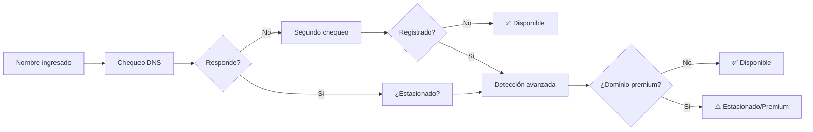
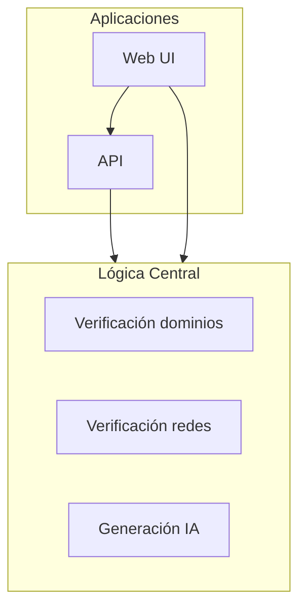
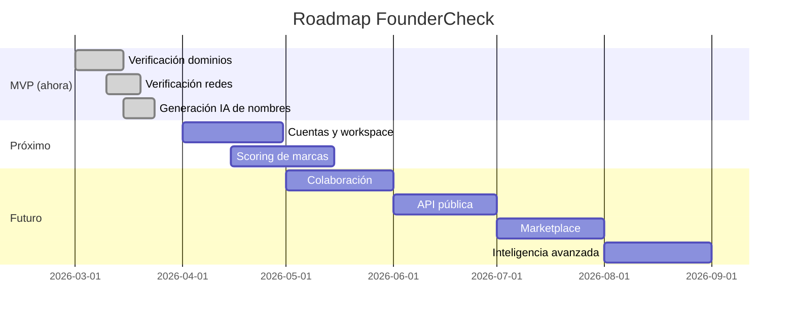

## TL;DR

FounderCheck es una plataforma web donde ingresás un nombre (o una idea en lenguaje natural) y te devuelve al instante la disponibilidad de dominios y redes sociales. Además genera nombres de marca con IA, detecta dominios estacionados que parecen libres, y pronto tendrá workspace para gestionar todos tus proyectos. Construido en TypeScript, con un modelo de suscripción pensado para founders independientes y equipos pequeños.

---

## El problema: "me encanta el nombre, ¿está libre?"

Cualquier founder que haya lanzado algo conoce este momento: se te ocurre un nombre, te emociona, lo buscás en Google y... ya existe. O peor: el dominio está libre pero el Instagram no. O viceversa. O el dominio parece libre pero resulta ser un dominio estacionado que alguien quiere vender por 5000 dólares.

Este proceso de validación manual es tedioso, fragmentado, y propenso a errores. Abrís una pestaña para el dominio, otra para Instagram, otra para GitHub, otra para TikTok, otra para X. Cada una con un flujo distinto. Cada una con resultados que no son siempre claros.

Ese es exactamente el problema que FounderCheck resuelve.

---

## Qué hace FounderCheck

Fundamentalmente tres cosas: verificar, generar y gestionar.

### Verificación de dominios (la que más trabajo costó)

No es tan simple como hacer un ping y ver si responde. La mayoría de las herramientas solo checkean DNS, y si no responde, marcan el dominio como disponible. Grave error.

FounderCheck usa un sistema de verificación en múltiples capas para distinguir dominios genuinamente disponibles de aquellos que están estacionados o son premium — esos que parecen libres pero cuando intentás comprarlos te piden una fortuna.

> [!warning] El problema de los dominios "libres"
> Hay miles de dominios estacionados que no tienen DNS configurado. Las herramientas de validación más comunes los marcan como disponibles. Cuando intentás comprarlos, descubrís que cuestan cientos o miles de dólares. FounderCheck detecta estos casos con un sistema de verificación avanzada.

### Verificación de redes sociales

Checkea la disponibilidad del username en GitHub, Instagram, TikTok y X. Cada plataforma tiene su propia lógica de detección, porque ninguna devuelve un resultado limpio cuando un usuario no existe.

### Generación de nombres con IA

Esta es la feature que más me entusiasma. En vez de solo verificar un nombre que ya tenés en mente, podés escribir una idea en lenguaje natural y FounderCheck genera 5-10 nombres de marca con justificación.

Ejemplo: escribís _"quiero una app de gimnasio"_ y recibís opciones con su respectiva justificación ("ForceHub — combina la idea de fuerza con la connotación tech de 'hub'"), más la disponibilidad de dominio y redes para cada una.

El generador detecta automáticamente el idioma del usuario para responder en el mismo, y usa modelos de lenguaje para producir nombres creativos y contextualmente relevantes.

---

## El stack

No me gusta elegir tecnologías solo porque están de moda. Cada pieza tiene una razón de ser:

| Capa     | Tecnología                    | Por qué                                                               |
| -------- | ----------------------------- | --------------------------------------------------------------------- |
| Monorepo | Turborepo + pnpm workspaces   | Core compartido entre API y web sin duplicar lógica                   |
| API      | Framework type-safe           | Liviano, validación automática, documentación integrada               |
| Web      | Astro + Preact + Tailwind CSS | SSR para performance, Preact para interactividad sin el peso de React |
| Core     | Paquete compartido            | Un solo lugar con toda la lógica de verificación                      |
| Tests    | Vitest                        | Rápido, buen developer experience                                     |

> [!tip] Monorepo
> La decisión de usar un monorepo no es gratuita. Al compartir el paquete core entre la API y la web, cualquier cambio en la lógica de verificación se refleja en ambos lados automáticamente. No hay "acordarse de actualizar el otro repo".

---

## Lo que viene

FounderCheck hoy es un MVP que funciona. Pero la visión es que se convierta en la plataforma definitiva de descubrimiento y validación de marcas para founders, agencias y desarrolladores.

### Cuentas y workspace

Registro con Google y GitHub. Workspace personal para guardar búsquedas, favoritos e historial. Organización por proyecto — mi app de fitness, mi startup SaaS, mi freelance.

### Scoring de marcas

Puntuación automática de cada nombre basada en pronunciabilidad, longitud, memorabilidad, disponibilidad transversal y potencial de trademark. Comparativa lado a lado entre candidatos.

### API pública

REST API con API keys para que desarrolladores integren verificación de marcas en sus propios productos. Webhooks para monitorear cambios de disponibilidad.

### Marketplace

Integración con registradores de dominios para comprar directamente desde FounderCheck. Sugerencia de servicios complementarios: logo, trademark, hosting.

---

## Modelo de suscripción

FounderCheck no es open source. Es un producto con un modelo de suscripción pensado para founders independientes, agencias y equipos de desarrollo que necesitan validar marcas de forma recurrente.

La idea es simple: la validación de marcas no es algo que hacés una vez. Es algo que hacés cada vez que se te ocurre una idea, cada vez que starts un proyecto nuevo, cada vez que un cliente te pide opciones. Un modelo de suscripción tiene más sentido que un pago único porque el valor está en el uso continuo.

---

## Cómo usarlo

1. Creás tu cuenta en FounderCheck
2. Escribís el nombre que querés validar (o una idea en lenguaje natural)
3. En segundos tenés la disponibilidad completa: dominio, GitHub, Instagram, TikTok, X
4. Si usaste el generador de nombres, recibís opciones con justificación y disponibilidad
5. Guardás los resultados en tu workspace para comparar después

---
