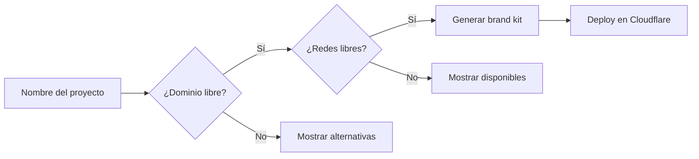
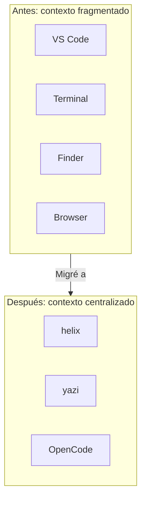
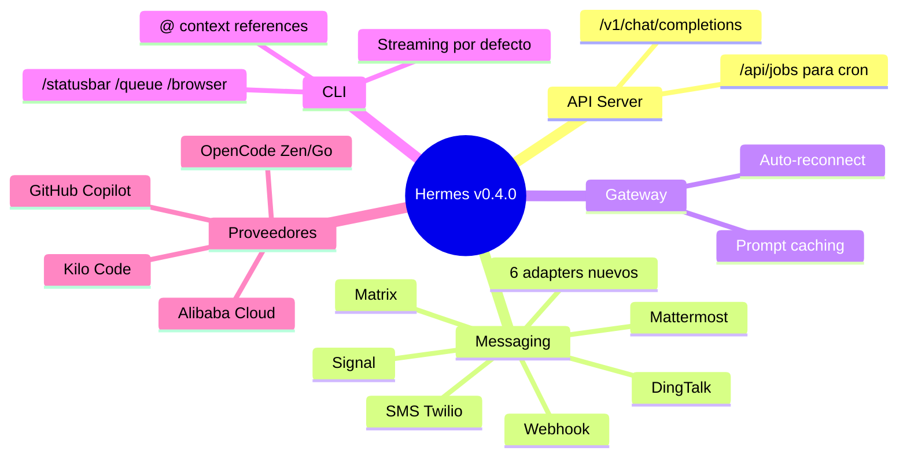

## TL;DR del día

Primer día de "Volviendo a crear". Migré [FounderCheck](/blog/proyectos/foundercheck) de CLI a interfaz web, definí el MVP (brand kit + deploy), y de pura inercia terminé instalando helix y yazi — un editor y un file manager en terminal que me hicieron cuestionar si realmente necesito una IDE gráfica abierta todo el día.

---

## Migrando FounderCheck a web

[FounderCheck](/blog/proyectos/foundercheck) arrancó como un script de CLI que hacía algo muy específico: validabas que el nombre de tu proyecto estuviera disponible en dominios y redes sociales, y si todo estaba libre, te desplegaba un template + CI/CD en Cloudflare Worker + GitLab. Útil, pero con un problema: era un script. No podías mostrarle eso a un founder no técnico y decirle "usá esto".

Hoy lo migré a interfaz web. El flujo ahora es: entrás, ponés el nombre de tu proyecto, y en minutos tenés un brand kit básico levantado. Sin tocar terminal, sin configurar Cloudflare a mano, sin saber qué es un worker.

El MVP quedó deliberadamente chico: brand kit + deploy. Nada más. La tentación de agregar features es fuerte, pero primero necesito que esto funcione bien para una cosa antes de hacerlo hacer cinco cosas mal.

> [!tip] Lección del día
> MVP deliberadamente chico > MVP que lo intenta todo. Si no funciona para una cosa, no va a funcionar para cinco.

Lo que viene acá: revisar los leads que Hermes generó, armar un elevator pitch corto para contactarlos, y generar una micro-landing con lista de espera para ir buscando clientes mientras construyo.

---

## Por qué probé helix (y por qué creo que vale la pena)

Mientras trabajaba con OpenCode se me armó una sensación que probablemente muchos devs conocen: tener 47 ventanas abiertas y sentir que el contexto se te escapa entre tantas apps. Terminal acá, editor allá, file manager en otro lado, browser con documentación, notificaciones de Slack. Todo contribuye, nada centraliza.

Así que busqué opciones para hacer todo desde la terminal. Encontré dos herramientas que me llamaron la atención.

### helix — el editor que no te obliga a aprender vim

helix es un editor de texto para la terminal, escrito en Rust, con una diferencia fundamental respecto a vim y neovim: no usa el modelo de modos (normal, insert, visual). En vez de eso, usa un paradigma de **selección-acción**. Primero seleccionás lo que querés modificar, después elegís qué hacer con eso.

Para el que nunca se acostumbró a la idea de tener que presionar `i` para empezar a escribir o `Esc` para salir, helix se siente mucho más natural. No estás "cambiando de modo", estás operando directamente sobre el texto.

Algunas cosas que me gustaron en el primer contacto:

- **Multi-cursor nativo**: seleccionás un patrón y editás todas las ocurrencias al mismo tiempo, sin plugins
- **LSP integrado**: soporte para autocompletado, ir a definición, y errores en tiempo real sin configurar nada extra
- **Tree-sitter**: syntax highlighting que no es regex — entiende la gramática del lenguaje, así que el coloreo es más preciso
- **Rápido**: al estar escrito en Rust, arranca y responde instantáneamente

¿Reemplaza a VS Code? Para mi uso diario todavía no. Pero como editor secundario para cambios rápidos o para cuando estoy 100% en la terminal, se siente como la herramienta correcta. Lo que tengo que evaluar es si con el tiempo puedo migrar flujos completos.

### yazi — navegar archivos sin salir de la terminal

yazi es un file manager de terminal, también en Rust. Lo que lo hace diferente de `nnn`, `ranger` o `lf` es que es asíncrono: las previsualizaciones de archivos no bloquean la navegación. Mientras te moves entre carpetas, las previews van cargando en background.

En la práctica significa que podés ver el contenido de un archivo mientras navegás sin que se sienta lento. También soporta preview de imágenes directamente en la terminal (si tu terminal soporta Sixel o Kitty graphics protocol).

No profundicé mucho todavía, pero el combo yazi + helix se siente prometedor: navegás con yazi, abrís archivos con helix, todo sin tocar el mouse.

### El antes y el después

|                     | Antes                                 | Después                            |
| ------------------- | ------------------------------------- | ---------------------------------- |
| Ventanas abiertas   | 12+                                   | 3                                  |
| Cambios de contexto | Constantes                            | Mínimos                            |
| Mouse               | Obligatorio                           | Opcional                           |
| Stack               | VS Code + Terminal + Finder + Browser | Terminal (helix + yazi + OpenCode) |

> [!note] Qué falta por evaluar
> Todavía no migré flujos completos a helix. Lo estoy usando como editor secundario. La prueba de fuego será cuando intente hacer un debug session entera sin salir de la terminal.

---

## Actualicé Hermes y me sorprendió lo que cambió

De paso actualicé Hermes Agent. Estaba 315 commits atrás — de la v0.4.0 del 18/3 a la v0.4.0 del 23/3. Sí, misma versión, pero el changelog entre medias es enorme.

Lo más interesante:

- **API server compatible con OpenAI**: podés exponer Hermes como endpoint `/v1/chat/completions`. Esto significa que cualquier app que hable con OpenAI puede hablar con Hermes directamente.
- **6 nuevos adapters de messaging**: Signal, DingTalk, SMS (Twilio), Mattermost, Matrix y Webhook. Se suman a Telegram, Discord y WhatsApp.
- **Prompt caching en el gateway**: cachea la instancia del agente por sesión. Para conversaciones largas con Anthropic, esto reduce costos de forma dramática.
- **@ context references**: estilo Claude Code, podés hacer `@archivo` o `@url` para inyectar contexto directo.
- **Streaming por defecto**: antes había que activarlo, ahora viene on desde el inicio.

> [!warning] No actualizar herramientas por meses
> 315 commits de diferencia es mucho. Me hizo pensar en cuántas veces no actualizamos las herramientas que usamos diario y nos perdemos de mejoras que podrían ahorrarnos tiempo. Vale la pena hacer un check semanal.

---

## Próximos pasos

Lo que viene para el Día 2:

- Revisar los leads que Hermes generó para FounderCheck
- Armar un elevator pitch o mensaje corto para contactarlos
- Empezar a diseñar la micro-landing con lista de espera
